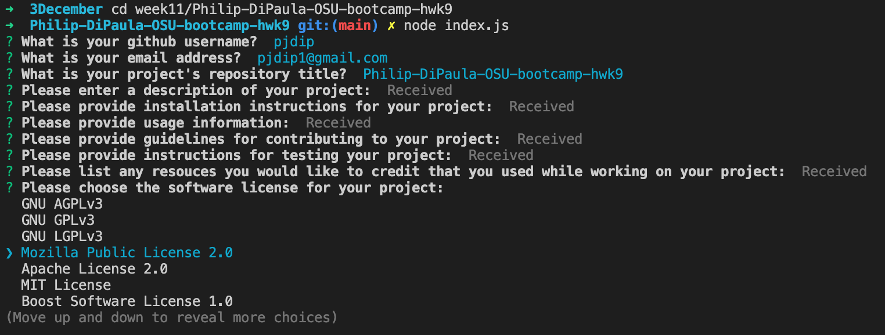
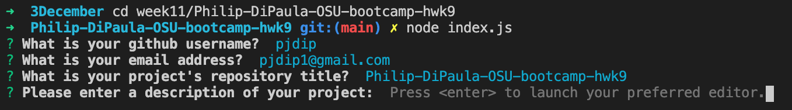
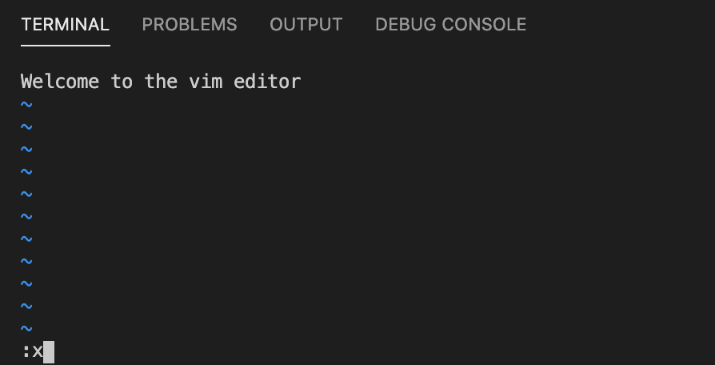
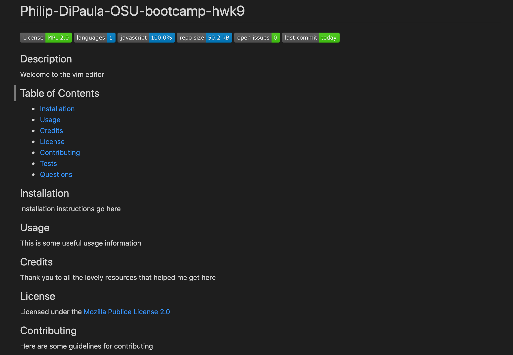

# Philip-DiPaula-OSU-bootcamp-hwk9

## These are the files for the homework assignment associated with section 9 of the OSU Web Development Bootcamp

The goal of this assignment was to create a command-line interface (CLI) application that dynamically generates a professional README.md file from a user's input using the [Inquirer package](https://www.npmjs.com/package/inquirer).

* [Installation](#installation)
* [Usage](#usage)
* [Credits](#credits)
* [Badges](#badges)
* [License](#license)

## Installation

Installation requirements include node.js and inquirer.js
You will find package dependency .json files in github repo that should allow inquirer to work without any further effort on your end. You will need to install node on your own. Installation options for node can be found [here](https://nodejs.org/en/download/)

## Usage 

In order to use this application, first clone the repo to your local machine. Then use the command line to navigate to the main folder containing index.js. If you have node installed, you should be able to run the application using the command 'node index.js'. If you have any troubles running the application, try doing 'npm install' from the main folder and then try again.

Once the application is initiated, you will be prompted to input some contact information and the various sections of your README.md. For the README sections, an instance of your preferred editor will open a temporary file (The editor to use is determined by reading the $VISUAL or $EDITOR environment variables. If neither of those are present, notepad (on Windows) or vim (Linux or Mac) is used). Save and Close (in vim, hit 'esc' then type ':x' and hit 'enter) the temporary file when you are done and it will be stored as your input. Remember that you are creating a .md file, so you will want to enter section inputs in the Markdown language. Once you have completed the final input (choosing your software license), your README.md file will be created and added to the generatedREADME folder found within the main folder. If you choose to run the application again, any file entitled README.md in that same folder will be overridden, so be sure to rename/relocate any README.md you would like to save for later before using the application again.

Here are some screenshots:
License List: 
Editor launch prompt: 
Vim: 
Sample: 

Here is a link to a video [walkthrough](https://drive.google.com/file/d/1HXtIRh221Ix1JQ-mRPvJ3OlGtJ_MhcSF/view?usp=sharing) which can also be found in the repo on github in the assets folder

## Credits

Special Thanks to Inquirer.js documentation:
* [docs](https://www.npmjs.com/package/inquirer)
* [examples](https://github.com/SBoudrias/Inquirer.js)

Thanks to the following for help with license things:
* [explanations](https://choosealicense.com/licenses/)
* [examples](https://gist.github.com/lukas-h/2a5d00690736b4c3a7ba)

Thanks to some vim resources for helping me figure out how to use the editor:
* [opensource.com](https://opensource.com/article/19/3/getting-started-vim)
* [phoenixnap.com](https://phoenixnap.com/kb/how-to-exit-vim)

Thanks to [matiassingers](https://github.com/matiassingers/awesome-readme) for some good README.md examples

Special Thanks to [ChilledCow](https://www.youtube.com/channel/UCSJ4gkVC6NrvII8umztf0Ow) for providing chill lofi beats to code to

## Badges

## License

Licensed under the [GNU General Public License v3.0](https://choosealicense.com/licenses/gpl-3.0/)

---